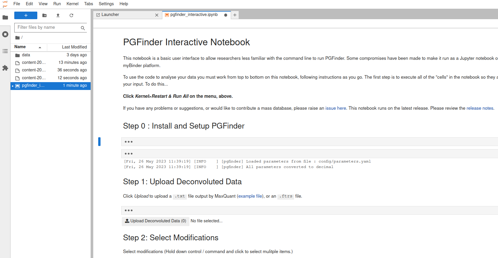

# Usage

There are two approaches to using PGFinder, Notebooks or at the Command Line. The [Data Dictionary](data_dictionary.md)
describes software inputs and outputs.

## Online Notebooks

Interactive Notebooks are implemented via
[pgfinder-jupyterlite](https://github.com/Mesnage-Org/pgfinder-jupyterlite). To use these go to
[mesnage-org.github.io/pgfinder-jupyterlite](https://mesnage-org.github.io/pgfinder-jupyterlite/lab?path=pgfinder_interactive.ipynb).

### IMPORTANT - Clearing Cache

This implementation of Notebooks is relatively new and it is important that your browser has loaded the
page anew **each and every time you wish to run analyses** so that it does not use a cached version from a previous
visit you have made to the site. How you do this will depend on the browser you are using.

#### Firefox

Instructions on clearing the cache for a single site for [Firefox](https://superuser.com/a/733154). Alternatively
click on the padlock to the left of the address bar and select `Clear cookies and site data...`. Then refresh the page
by pressing `F5`.


#### Chrome/Chromium

Instructions on clearing the cache for a single site for
[Chrome/Chromium](https://www.guidingtech.com/clear-chrome-cookies-cache-one-site-only/) areavaiable, but you can use
the shortcut of pressing `Shift + F5`

#### Opera

Instructions on clearing the cache for a single site for [Opera](https://forums.opera.com/post/229032). Alternatively
clock on the padlock to the left of the address bar and select `Site settings` then clock on the `Clear data`
button. Then refresh the page by pressing `F5`.


### Running Analyses

Once the page is loaded you will see the following [JupyterLab](https://jupyter.org/) layout.


To run the analysis follow the instructions and select _Kernel > Restart Kernel and Run All Cells_. This will take a
little while to run (30-60 seconds) because `pgfinder` and its dependencies are being installed. Once completed you
should see some output indicating that parameters have been loaded and buttons and menus should appear under each of the
**Step N** headings as shown in the image below.



You can now work through each of the steps uploading Deconvoluted Data, Selecting Modifications, Choosing or uploading a
Mass Library, setting the PPM tolerance and the Time Window for in-source decay and salt adduct clean up.

**NB** In versions of the Notebook that ran under myBinder it was essential that you wait for file uploads to complete
before attempting to run your analysis. This is most relevant when uploading `.ftrs` files during **Step 1**. You can
tell that your uploads (whether that is `.ftrs` or `.csv` files at **Step 1** or **Step 3**) have completed because the
filename will be listed beside the upload button in the Notebook as highlighted in the image below. However, because
this Notebook is running in your browser the upload is only going from your local harddrive into the memory your browser
is using and should happen very quickly.


Once all files have uploaded you are ready to run your analysis by clicking on the **Run Analysis** at the bottom. On
completion this button will change to show **Results**, click on this button to download your results.


### Testing pre-release candidates

If a development version with new features is available for testing you can test it in the Notebook by explicitly
stating the version of `pgfinder` that should be used. To do this a pre-release candidate will need to be released to
PyPI (see [Contributing](contributing.md)) and you will need to know the full version including the pre-release
suffix (see the [Release History](https://pypi.org/project/pgfinder/#history)). You then append this version to the
`%pip install pgfinder` command in the first code cell.

Clear the cache for the site and reload it (see **IMPORTANT** note above) and start a fresh instance of the Notebook,
but before restarting the kernel you need to modify the version of PGFinder that is installed explicitly under **Step
0 : Install and Setup PGFinder**.

Code cells are hidden by default in the Notebooks, to expand them click on the **first** set of three dots and you will
see a Notebook cell with the line `%pip install pgfinder` in it. If the release candidate is `v0.0.4-a5` then append
(without the leading `v`) to the install command separating with `==`, i.e. `%pip install pgfinder==0.0.4-a5`.


You can now restart the kernel (_Kernel > Restart Kernel and Run All Cells_) and run your analysis and the features in
the candidate release will be run.


## Command Line

If you wish to use the command line version you will have to follow the [installation](installation.md) instructions to
install PGFinder on your computer.

## `find_pg`

You can also use the command line interface `find_pg` which works with a YAML configuration file (see
`config/example.yaml`) for an example which you can modify. You must supply at least one option on the command line `-c
<path/to/config.yaml>`, so to use the example config you would.

``` bash
find_pg -c config/example.yaml
```

Each option in the configuration file can be over-ridden at the command line, see `find_pg --help` for more
information.
