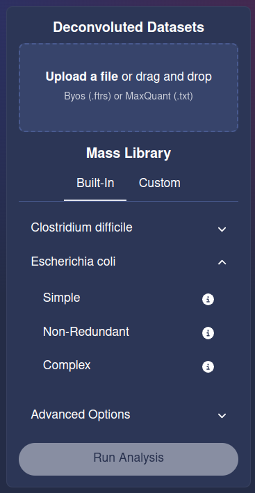

# Usage

Two options are available to run PGFinder: (i) an online Web User Interface (WebUI) or (ii) a Command Line Interface. 
The [Data Dictionary](data_dictionary.md) describes software inputs and outputs.

## WebUI

An interactive web-page for running your analysis is available at
[mesnage-org.github.io/pgfinder-gui/](https://mesnage-org.github.io/pgfinder-gui/). On first visiting the page you will
have to wait a whilst it sets up in the background (for those curious or interested it is using
[pyodide](mesnage-org.github.io/pgfinder-gui/) a [Web Assembly language (WASM)](https://webassembly.org/) in the
background to install PGFinder and all its Python dependencies). Once loaded the page should look like the image below.


### Upload a file

You should click on the large button with a dashed border to **Upload a file** and select your Byos (`.ftrs`) or
MaxQuant (`.txt`) file that you wish to analyse. Please note that the versions currently supported for Byos is 3.11 and MaxQuant is 2.4.2.0. 
Please note that this WebUI allows you to upload multiple deconvoluted datasets to perform several searches with the same database in one go. 
Each search output will be downloaded as an individual .csv file.  

### Choose a Mass Library

You then have the option to chose which **Mass Library** will be used to compare your sample to. There are several
provisioned for your convenience, from two bacterial species _Clostridium difficile_ and _Escherichia coli_. Each
species has three associated libraries, `Simple` / `Non-Redundant` / `Complex` and you can choose which to select by
clicking on the downwards point arrow next to the species name to expand the options and clicking on on the library you
wish to use, it will turn white to indicate it has been selected as shown below (**NB** hover the mouse of the circle
with an `i` in it and tool-tip box will pop-up describing the library).




#### Using a Custom Library

If you have your own library you can choose to upload it by clicking on **Custom** and the the **Upload a file** box
that appears under this and selecting your `.csv` file to upload.

### Advanced Options

A number of advanced options are now available and they can be viewed and set by clicking on the downwards point arrow
next to the text **Advanced Options**.

#### Modifications

A scrollable list of modifications is presented, select by clicking on these. You can select as many modifications as
you like, just click on those you want to enable and the background will turn white to indicate it has been
selected. The list is long but there is slider on the right or you can scroll up and down with your mouse-wheel if you
have one.

#### PPM Tolerance

The Parts Per Million tolerance for matching molecules can be set, enter a number in the box underneath the **PPM
Tolerance** heading.

#### Cleanup Window

The Cleanup Window parameter can also be set.

In the screenshot below we have...

1. Uploaded the `ftrs_test_data.ftrs` file.
2. Selected the _Escherichia coli_ **Non-Redundant** mass library.
3. Enabled Sodium and Potassium Modifications.
4. Set the PPM to 15.
5. Set the Cleanup Window to 0.6.


### Run Analysis

Once you are ready to run the analysis simply click on the **Run Analysis** button.

### Results

Analysis will run and a CSV file will automatically download, you should see a pop box telling you the file has
downloaded. In most browsers, unless the configuration has been changed, the file will be downloaded to the `Downloads`
directory on your computer. Most browsers let you see a list of files that have been downloaded if you press `Control +
j`.

The results have the same name as the input file but with the extension `.csv`. This can be opened in statistical
software or spreadsheets for subsequent viewing.

## Command Line

If you wish to use the command line version you will have to follow the [installation](installation.md) instructions to
install PGFinder on your computer.

## `find_pg`

You can also use the command line interface `find_pg` which works with a YAML configuration file (see
`pgfinder/default_config.yaml`) for an example which you can modify. You must supply at least one option on the command line `-c
<path/to/config.yaml>`, so to use the example config you would.

``` bash
find_pg -c pgfinder/default_config.yaml
```

Each option in the configuration file can be over-ridden at the command line, see `find_pg --help` for more
information.
