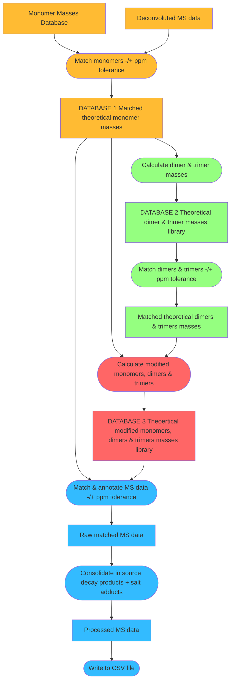

# Summary

Peptidoglycans are a key components in cell membrane of Gram-positive bacteria and mediate the exchange of DNA between
cells and the response to anti-bacterial drugs. Understanding their biogenesis and structure is key to understanding how
cell surface properties modulate antimicrobial resistance and host-pathogen interactions. The field of
_Peptidoglycomics_ that seeks to model and determine the structure of these molecules based on laboratory based
chromatography is in its infancy but progress will be greatly facilitated by development of software tools such as
`PGFinder` which introduces a streamlined workflow pipelines for analysing and working with laboratory generated data.

# Statement of need

The fields of Proteomics and Glycomics have many software solutions available, but none are currently suited to the
analysis of peptidoglycan molecules which are made from a backbone of glycan chains with peptide side-chains each of
which are themselves composed of unusual sugars and amino acids. As a consequence researchers have traditionally relied
on laborious and error prone manual analysis of data generated from reversed-phase High-Pressure Liquid Chromatography
(rp-HPLC) and mass spectroscopy (MS) as no automated tools were available. `PGFinder` is implemented the popular Python
language and addresses this short-coming by introducing an automated workflow of PG structural analysis built on
open-access principles that enable replicable and reproducible analyses to be undertaken and in turn peer-reviewed. As
such `PGFinder` instantiates the field of peptidoglycomics on a firm footing.

# Package Overview

`PGFinder` takes as input a list of known masses for given set of molecules <**TODO** what molecules are included in the
masses_file and how to describe them?> and a set of target molecules from rp-HPLC and Mass spectroscopy that contains a
list of molecules of unknown components which may be monomers, dimers or trimers. The target molecules are then fuzzily
matched itteratively to molecules of known size for a user specified set of modifications. An overview of this workflow
is shown in figure **TODO** reference and link to figure.

# Resources and Examples

`PGFinder` is available on [PyPI](https://pypi.org/project/pgfinder/) and the development code is openly available on
[GitHub](https://pypi.org/project/pgfinder/). Documentation is also available
[online](https://mesnage-org.github.io/pgfinder/) and example Jupyter Notebooks are available in Google Colab for users
to test and use.

# Citations

# Acknowledgements

Funding to develop and improve documentation and accessibility to `PGFinder` was
provided by the [Unleash Your Data and Software](https://www.sheffield.ac.uk/library/rdm/unleashdatasoftware)
initiative at The University of Sheffield.

# References
