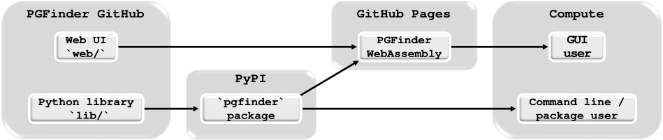

# Summary

Peptidoglycan is an essential and ubiquitous component of the bacterial cell envelope that is the target of widely used antibiotics such as penicillin [@vollmerPeptidoglycanStructureArchitecture2008a].
This giant, net-like molecule surrounds the bacterium to maintain cell shape and confer protection against osmotic stress.
To grow and divide, bacteria remodel their peptidoglycan via numerous cleavage and polymerisation events, making it a remarkably dynamic molecule.
Furthermore, peptidoglycan fragments released during bacterial growth represent important signalling molecules that play a key role in host-pathogen interactions [@bastosUptakeRecognitionResponses2021].
Recent work also suggested that peptidoglycan fragments released by gut bacteria modulate neurodevelopmental disorders [@gabanyiBacterialSensingNeuronal2022; @gonzalez-santanaBacterialPeptidoglycansMicrobiota2020].
Understanding the biogenesis and structural diversity of peptidoglycan is therefore vital to understanding bacterial growth, division, antibiotic resistance, and host-pathogen interactions.
Since peptidoglycan structure was first described in the late 1980s, studying it has meant digesting the entire molecule into smaller fragments (disaccharide-peptides) that can be separated by chromatography and analysed via mass spectrometry (together referred to as LC-MS).
Crucially, however, this experimental approach generates large datasets (typically 250MB files) that can make manual data analysis challenging.
This work describes the first open-source software dedicated to the automated analysis of peptidoglycan LC-MS datasets, paving the way for true "peptidoglycomics" studies.

# Statement of need

The large peptidoglycomics datasets generated by LC-MS contain many unusual amino acids and peptide bonds that cannot be handled by software designed solely for glycomics or proteomics.
As a result, the analysis of peptidoglycan structure remains a biased, manual, error prone, and inconsistent process — essentially relying on the use of Microsoft Excel spreadsheets to map theoretical masses to peptidoglycan fragments.
To address this, we developed a tool called PGFinder that is dedicated to peptidoglycan analysis.
PGFinder is implemented in the popular Python programming language and introduces an automated workflow for peptidoglycan structural analysis that is built on open-access principles and enables reproducible analyses and peer-review [@patelPGFinderNovelAnalysis2021a].
PGFinder first requires the deconvolution of LC-MS datasets using another open-source software like Maxquant [@coxMaxQuantEnablesHigh2008], then the observed masses in the deconvoluted data are matched with theoretical masses corresponding to disaccharide-peptides before looking for modified or polymerised versions of these building blocks.
The search output provides information about the molecules detected by LC-MS, including their abundance, charge state, retention time, and intensity.
These automated analyses can be performed via a user-friendly web interface, allowing researchers lacking prior programming experience to still use PGFinder.

{width="100%"}

Our approach makes the most of the free resources currently available on GitHub and PyPI.
The web tool can be hosted on GitHub Pages since the analysis itself is performed client-side via Pyodide and WebAssembly.
This is possible due to the moderate compute requirements of peptidoglycomics compared with more ambitious metagenomic analyses.
In the future, a server-side approach will be necessary to embark on metapeptidoglycomics, where comparisons are made between large numbers of samples from different geographic areas, patients or ecological niches.
In the meantime, PGFinder is helping the field of peptidoglycomics to mature into its place amongst the more established -omics domains.

# Acknowledgements

Funding to develop and improve documentation and accessibility to PGFinder was provided by the Unleash Your Data and Software initiative at The University of Sheffield as well as IAA BBSRC and MRC MR/S009272/1 grants to SM.
BJR and AVP were funded by iCASE DTP studentships (BBSRC WR BB/M011151/1 and NERC ACCE NE/S00713X/1, respectively).
The authors acknowledge Marshall Bern (ProteinMetics) for his constant support.

# References
