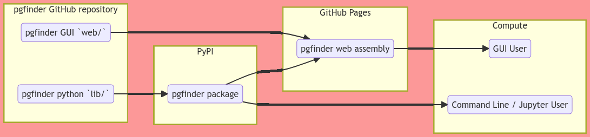

# Summary

Peptidoglycan is an essential and ubiquitous component of the bacterial cell envelope that is the target of the most widely used antibiotics like penicillin [@vollmerPeptidoglycanStructureArchitecture2008a].
This giant net-like molecule surrounds the bacterial cell to maintain cell shape and to confer protection against osmotic stress.
During bacterial growth and division, the structure and composition of peptidoglycan undergoes partial cleavage and polymerisation events (a process called remodelling).
Peptidoglycan fragments released during bacterial growth represent important signalling molecules that play a key role in host-pathogen interactions [@bastosUptakeRecognitionResponses2021].
Recent work also suggested that peptidoglycan fragments released by gut bacteria modulate neurodevelopmental disorders [@gabanyiBacterialSensingNeuronal2022; @gonzalez-santanaBacterialPeptidoglycansMicrobiota2020].
Understanding the biogenesis and structure of peptidoglycan is therefore of paramount importance to understand bacterial growth, division, antibiotic resistance as well as, host-pathogen interactions.
Peptidoglycan structure was described in the late 1980s requiring the digestion of the entire molecule into smaller fragments that are separated by chromatography and analysed by mass spectrometry, referred to as LC-MS.
This experimental approach generates large datasets (typically 250MB files).
This work describes the first open-source software dedicated to the automated analysis of peptidoglycan LC-MS datasets, paving the way for “peptidoglycomics” studies.

# Statement of need

The analysis of peptidoglycan structure and composition requires the purification of this molecule and its hydrolysis into smaller, soluble fragments (disaccharide-peptides).
These smaller molecules are analysed by LC-MS, which generate large ‘Omics datasets.
Peptidoglycan fragments contain unusual amino acids and unusual peptide bonds so peptidoglycan LC-MS datasets cannot be handled by software dedicated to proteomics or glycomics studies.
As a result, the analysis of peptidoglycan structure remains a biased, manual, error prone and inconsistent process, essentially relying on the use of Microsoft Excel spreadsheets containing theoretical masses corresponding to peptidoglycan fragments.
We developed a tool called PGFinder dedicated to peptidoglycan analysis.
PGFinder is implemented in the popular Python language and addresses this short-coming by introducing an automated workflow of PG structural analysis built on open-access principles that enable replicable and reproducible analyses to be undertaken and in turn peer-reviewed [@patelPGFinderNovelAnalysis2021a].
PGFinder first requires the deconvolution of LC-MS datasets using an open-source software like Maxquant [@coxMaxQuantEnablesHigh2008].
The observed masses in the deconvoluted data are matched with theoretical masses corresponding to peptidoglycan structures.
The search output provides information about the molecules detected by LC-MS such as their abundance, charge state, retention time or intensity.
This process can be achieved using a “serverless” WebAssembly Graphical User Interface to enable users with no expertise in programming to use this tool.

Our approach makes maximum use of currently free resources on GitHub and PyPI, without the need to maintain a dynamic server application - the computing power for analysis is provided by the user.
This is possible due to the moderate compute requirements of Peptidoglycomics compared with metagenomics analyses.
A future, server based, approach to handling data will be necessary to embark on Metapeptidoglycomics, where comparisons are made between large numbers of samples e.g. from different geographic areas, patients or ecological niches.
In the meantime, PGFinder is allowing the field of Peptidoglycomics to mature into its place amongst more established -omics domains.

# Acknowledgements

Funding to develop and improve documentation and accessibility to PGFinder was provided by the Unleash Your Data and Software initiative at The University of Sheffield as well as IAA BBSRC and MRC MR/S009272/1 grants to SM.
BJR and AVP were funded by iCASE DTP studentships (BBSRC WR BB/M011151/1 and NERC ACCE NE/S00713X/1, respectively).
The authors acknowledge Marshall Bern (ProteinMetics) for his constant support.

# References
